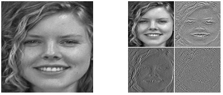

# Uma análise extensa de funções wavelet para a tarefa de reconhecimento facial

Esse projeto foi parte do trabalho de conclusão de curso na Universidade Federal Rural de Pernambuco

Neste projeto de aprendizagem de máquina, são combinados métodos de extração de características como o PCA e o LDA em conjunto com a Transformada Wavelet Discreta para a tarefa de reconhecimento facial. Uma análise estatística de diferentes funções de decomposição wavelet é realizada em 7 diferentes bases de dados com diversas características.
Um total de 4 classificadores foram utilizados para medir a capacidade do método de extração.

## Tecnologias Utilizadas

* Linguagem Python v. 2.7
* Numpy e OpenCV
* Sklearn para construção dos modelos
* Biblioteca PYWT para análise das funções

## Métodos de Extração de Características Utilizados

* Principal Component Analysis (PCA)
* Linear Discriminant Analysis (LDA) 
* Discrete Wavelet Transform (DWT) 

Visualização dos 5 primeiros eigenvectors após o PCA (meio) e a dispersão entre classes após LDA (baixo)
com 5 classes diferentes da base de dados Georgia Tech (topo).

   

Imagem original (esquerda) e decomposição em um nível pela DWT (direita) com as funções de haar (topo-esquerda), bior3.7 (baixo-esquerda), db5 (topo-direita) e sym16 (baixo-direita).

 

## Classificadores Utilizados

* Nearest Neighbor Classfier (1-NN): Classificador de distância;
* Gaussian Naive Bayes (GNB): Classificador probabilístico; 
* Support Vector Machines (SVM): Classificador com máquina de vetores suporte
* Random Forest Classifier (RFC): Classificador com árvores de decisão

## Bases de Dados Consideradas

* ORL 
* AR Face Database
* Essex Faces95
* Yale B Face Dataset
* Georgia Tech Face Dataset
* LFW - Labeled Faces in The Wild
* CASIA-WebFace

As funções wavelets que maximizam a acurácia para a tarefa de reconhecimento são então avaliadas com um intervalo de confiança de 95%.
Foram consideradas mais de 4.000.000 de taxas de acurácia média para avaliação e os experimentos mostraram que algumas dessas funções não são adequadas para a tarefa.
No entanto, outras funções são significativamente diferentes para os testes específicos considerados na pesquisa.
A função wavelet rbio3.1 da família Reverse Biorthogonal foi a que mais apresentou resultados de acurácia mais altos se comparada com as outras funções.

 - Algumas das bases de dados são disponíveis no link: https://drive.google.com/file/d/0B8NpXrXvc_i5LXBYRlBzYlBJdFU/view
